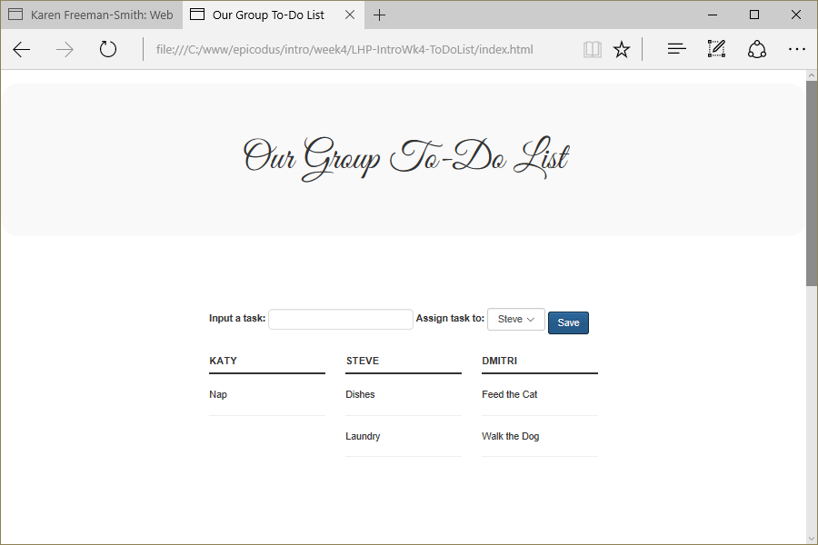

# Karen's To-Do List
Version 0.0.2: August 22, 2016
by [Karen Freeman-Smith](https://karenfreemansmith.github.io)

### Technologies Used
HTML, CSS, Bootstrap, JavaScript, jQuery, jQueryUI (drag & drop)

## Description
*[Learn How To Program](http://learnhowtoprogram.com) Intro to Programming Week 4 Individual Project: A web-based to-do list. Merged with Epicodus pair project to add drag & drop feature*

## Setup/Installation
* [View on Github Pages](https://karenfreemansmith.github.io/LHP-IntroWk4-ToDoList)
* _OR_
* Clone directory
* Open index.html in your favorite browser

## Support & Contact
For questions, concerns, or suggestions please email karenfreemansmith@gmail.com

## Specifications
When a user enters a task to do, it is output on the page
* Example Input: Walk the dog
* Example Output: Walk the dog

When a user finishes a task, they can do something to indicate that it is done.  
* Example Input: Walk the dog
* Example Output: X Walk the dog

User is able to put a priority on tasks and sort by priority
* Example Input: Walk the dog - priority 2, buy groceries - priority 1
* Example Output: buy groceries, walk the dog

Users are able to delegate tasks to others or claim them for themselves
* Example Input: Walk the dog, buy groceries
* Example Output: buy groceries - Steve, walk the dog - Bob

## Known Issues
* None

## Legal
*Licensed under the GNU General Public License v3.0*

Copyright (c) 2016 Copyright _[Karen Freeman-Smith](https://karenfreemansmith.github.io)_ All Rights Reserved.
